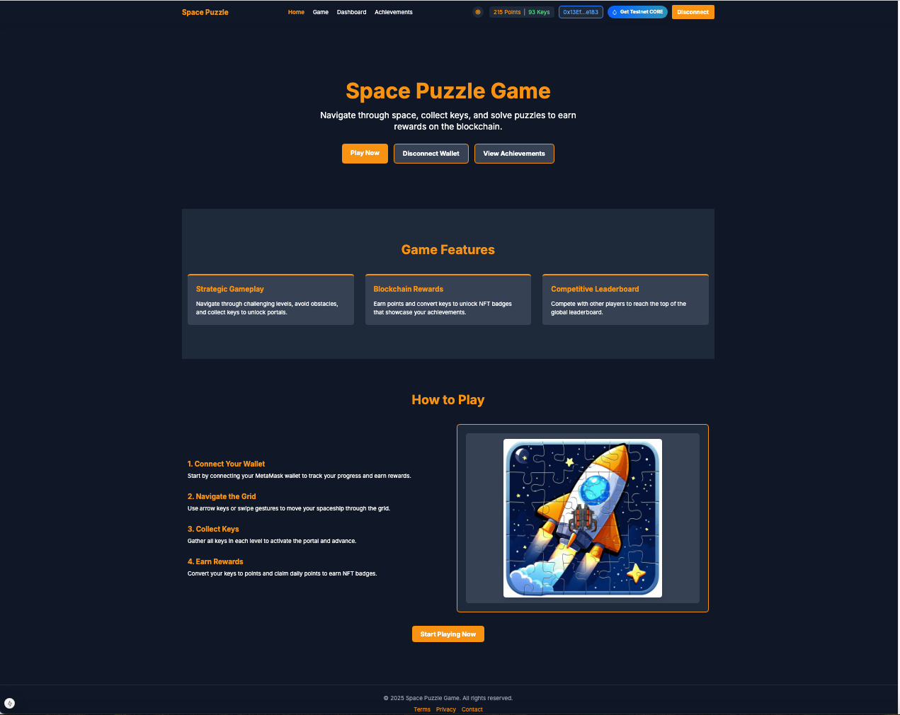

# Space Puzzle Game



## 🚀 Overview

Space Puzzle is an engaging blockchain-based puzzle game build on Core Blockchain that challenges players' logic and problem-solving skills in a cosmic adventure. Navigate through increasingly difficult levels, collect keys, unlock barriers, and reach portals while avoiding obstacles. Your progress, achievements, and rewards are securely stored on the Core blockchain, creating a truly decentralized gaming experience.

## 🌟 Features

### Core Gameplay Mechanics


- **Grid-Based Navigation**: Control your spaceship through a grid-based cosmic environment.
- **Progressive Difficulty**: Experience increasing challenges as you advance through levels.
- **Dynamic Elements**:
  - 🔑 **Keys**: Collect keys to unlock barriers and activate portals.
  - 🚪 **Barriers**: Require keys to pass through.
  - 🌀 **Portals**: Complete the level by reaching an activated portal.
  - ☄️ **Asteroids**: Avoid these immovable obstacles.
  - 🌈 **Teleporters**: Instantly transport your spaceship to paired locations.
  - ⚠️ **Bokoharams**: Dangerous entities that subtract 5 keys upon collision.

### Blockchain Integration -- Everything on Core Blockchain

- **Persistent Progress**: Game progress is stored on the Core blockchain.
- **Achievements as NFTs**: Earn NFT badges for reaching specific milestones.
- **Daily Rewards**: Claim points daily through blockchain transactions.
- **Resource Management**: Convert in-game keys to points through smart contracts.
- **Leaderboard System**: Compete globally with scores recorded on the blockchain.


### Player Progression

- **Badge System**: Earn Bronze Explorer, Silver Navigator, and Gold Commander badges as you progress.
- **Level Advancement**: Each completed level increases difficulty and rewards.
- **Key Economy**: Collect and manage keys as a valuable resource.

### UI/UX

- **Responsive Design**: Play on desktop or mobile devices with touch controls.
- **Real-time Feedback**: Visual and audio cues enhance gameplay experience.
- **Game Controls**: Use arrow keys, touch swipes, or on-screen buttons to navigate.

  

  

- **Dashboard**: Track your progress, badges, and rewards.


## 🔍 What Makes Space Puzzle Unique

1. **Blockchain-Powered Progress**: Unlike traditional puzzle games where progress is stored locally, Space Puzzle leverages the Core blockchain to ensure your achievements and rewards are permanently recorded and truly owned by you.

2. **NFT Integration**: Earned badges are minted as NFTs, providing tangible value and ownership of your accomplishments.

3. **Strategic Resource Management**: The key collection and conversion system introduces an economic element, requiring players to make decisions about when to use resources versus converting them for long-term gain.

4. **Progressive Challenge System**: The difficulty scales dynamically based on your level, introducing new elements and increasing complexity at a pace designed to challenge without frustrating.

5. **Cross-Device Experience**: Your game state follows you across devices thanks to Core blockchain persistence, allowing for a seamless gaming experience.

## 🧩 Puzzle Gaming Excellence

Space Puzzle exemplifies excellence in the Puzzle Games track by:

- **Logic Challenges**: Requiring strategic planning to determine the optimal path through each level.
- **Resource Optimization**: Forcing players to manage limited keys efficiently.
- **Spatial Reasoning**: Necessitating visualization of movement options and consequences.
- **Pattern Recognition**: Teaching players to recognize level structures and obstacle placements.
- **Progressive Learning Curve**: Introducing mechanics gradually so players can master each element before facing new challenges.

The game keeps players coming back through:

- **Achievement Milestones**: Clear goals with tangible blockchain rewards.
- **Daily Claim Mechanic**: Encouraging regular play sessions.
- **Score Competition**: Leaderboard ranking to foster community competition.
- **Procedurally Generated Levels**: Ensuring fresh challenges even for experienced players.


## 🔗 Blockchain Technology Integration

Space Puzzle leverages Core blockchain technology in several innovative ways:

### Smart Contract Functionality

- **Player Data Storage**: All player statistics (score, level, keys, badges) are stored in the `SpacePuzzleGame` smart contract.
- **Badge Minting**: Achievements are represented as ERC721 NFTs and mintable.
- **Daily Rewards**: The contract enforces a cooldown period for claiming daily points.
- **Resource Conversion**: A mechanism to convert 50 keys into 10 points is managed by the contract.
- **Leaderboard Tracking**: Top 10 global scores are tracked and maintained on-chain.

### Network Support

- **Core Testnet**: For development and testing (Chain ID 1114)
- **Core Mainnet**: For production gameplay (Chain ID 1116)
- **Testnet Faucet**: Request test tokens directly from the application's UI when connected to testnet.

### Web3 Integration

- **Wallet Connection**: Seamlessly connect your Web3 wallet to play and track progress.
- **Transaction Management**: Game-critical actions (saving progress, claiming rewards) are processed as blockchain transactions.
- **Network Detection**: Automatic detection of the connected network with helpful guidance.

## 🛠️ Prerequisites

Before running Space Puzzle, ensure you have:

1. **Node.js** (v16 or newer)
2. **npm** or **yarn** package manager
3. **MetaMask** or another Web3 wallet extension
4. **Core Network Configuration** in your wallet:
   - **Core Testnet**:
     - Network Name: Core Blockchain Testnet
     - RPC URL: https://rpc.test.btcs.network/
     - Chain ID: 1114
     - Currency Symbol: TCORE
     - Block Explorer: https://scan.test.btcs.network/
   - **Core Mainnet**:
     - Network Name: Core Blockchain Mainnet
     - RPC URL: https://rpc.coredao.org/
     - Chain ID: 1116
     - Currency Symbol: CORE
     - Block Explorer: https://scan.coredao.org/

## 🚀 Running Locally

Follow these steps to run Space Puzzle locally:

### Frontend Application

1. Clone the repository:

   ```bash
   git clone https://github.com/harystyleseze/space-puzzle-game.git
   cd space-puzzle-game
   ```

2. Install dependencies:

   ```bash
   npm install
   # or
   yarn install
   ```

3. Create a `.env.local` file in the project root with:

   ```
   NEXT_PUBLIC_SPACE_PUZZLE_GAME_ADDRESS=0xYourContractAddress
   ```

4. Start the development server:

   ```bash
   npm run dev
   # or
   yarn dev
   ```

5. Open [http://localhost:3000](http://localhost:3000) in your browser.

### Smart Contract Deployment (Optional)

If you want to deploy your own instance of the game's smart contract:

1. Navigate to the contracts directory:

   ```bash
   cd contracts
   ```

2. Install dependencies:

   ```bash
   npm install
   # or
   yarn install
   ```

3. Create a `.env` file with your private key:

   ```
   PRIVATE_KEY=yourPrivateKeyWithoutOxPrefix
   CORE_EXPLORER_API_KEY=yourApiKeyIfAvailable
   ```

4. Compile the contract:

   ```bash
   npx hardhat compile
   ```

5. Deploy to Core Testnet:

   ```bash
   npx hardhat run scripts/deploy.js --network core_testnet
   ```

6. Update the `.env.local` file in the project root with your new contract address.

## 🎮 How to Play

1. **Connect your wallet** using the "Connect Wallet" button.
2. Navigate to the **Play** section to start a new game.
3. **Move your spaceship** using arrow keys (desktop) or swipe/buttons (mobile).
4. **Collect all keys** in the level to activate the portal.
5. **Reach the activated portal** to advance to the next level.
6. **Save your progress** by quitting the game and confirming the save.
7. Visit the **Dashboard** to view your stats, badges, and claim daily rewards.
8. Check the **Achievements** page to see your earned and unearned badges.

## 📚 Game Controls

### Desktop

- **Arrow Keys**: Move the spaceship
- **P**: Pause/Resume game
- **R**: Restart level
- **ESC**: Quit game

### Mobile

- **Swipe**: Move in the direction of the swipe
- **On-screen arrows**: Move in the corresponding direction
- **P button**: Pause/Resume game
- **R button**: Restart level
- **X button**: Quit game

## 📊 Scoring System

- Completing a level: Points based on level number and difficulty multiplier
- Higher levels award more points
- Your high score is stored on the blockchain
- Top 10 global scores appear on the leaderboard

## 🏆 Achievements

- **Bronze Explorer**: Reach 50 points or complete 5 levels
- **Silver Navigator**: Reach 200 points or complete 10 levels
- **Gold Commander**: Reach 900 points or complete 20 levels

## 📱 Mobile Compatibility

Space Puzzle is fully responsive and playable on mobile devices with:

- Touch controls
- Swipe navigation
- On-screen buttons
- Responsive UI that adapts to screen size

## 🙏 Acknowledgements

- Core Blockchain for providing the infrastructure
- OpenZeppelin for secure contract libraries
- Next.js for the frontend framework
- All contributors and players of Space Puzzle

---

**Space Puzzle Game** — Explore the cosmos, solve puzzles, own your achievements.
